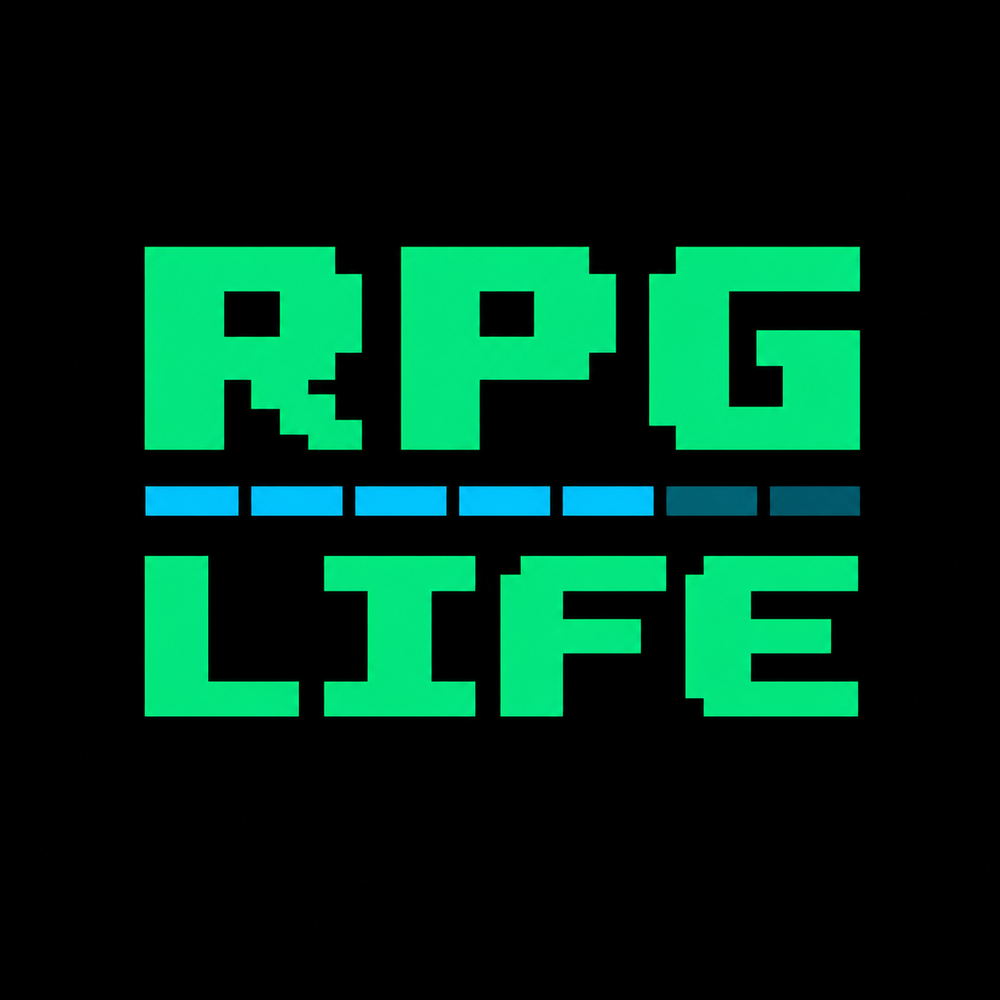

  

A gamified life exploration platform where users complete curated real-world challenges to gain experience and level up. Instead of creating their own tasks, users are guided through meaningful activities—ranging from social interactions to personal growth experiences—designed to push them out of their routine. With integrated social features like a public timeline, followers, and interactions, users can share their journey, stay motivated, and discover new ways to level up their lives.

## 🌟 Motivation

This is a personal project to rebuild a discontinued app called “Level Up Life.” The main goal is to use it for personal purposes, but it will also be shared publicly as a bonus to attract users.

For additional details about the project, please refer to the [Project Documentation](https://docs.google.com/document/d/1a7xo7uG15yPhXCKKnkHVF3bMUNI_UY0RsZPh_N-GynE).

## 📦 Tech Stack

- Frontend: React
- Backend: NestJS
- Database: PostgreSQL

## 🤝 Contributing!

Contributions are welcome! Please open an issue or submit a pull request.

## 📄 License

This project is licensed under the MIT License.
